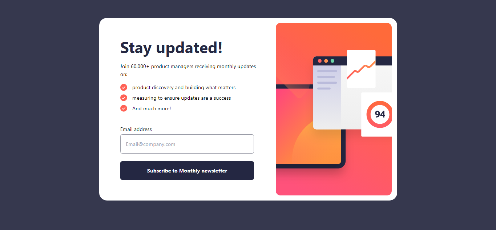
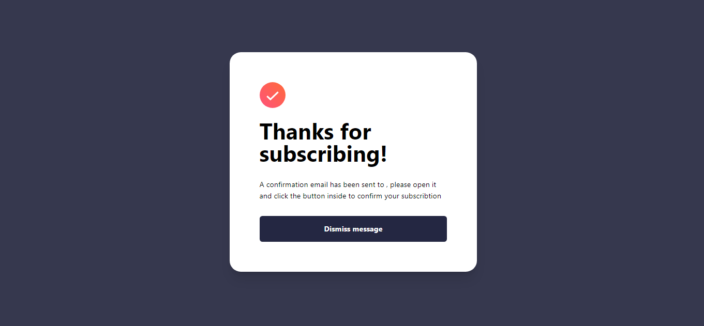
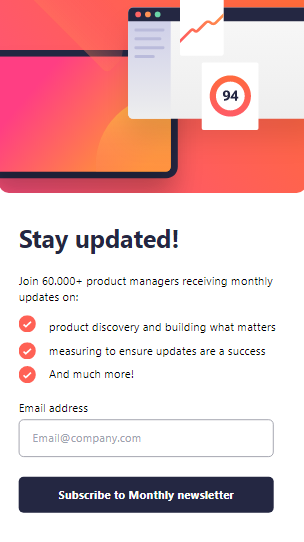
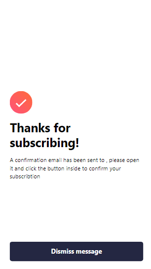

# Frontend Mentor - Newsletter sign-up form with success message solution

This is a solution to the [Newsletter sign-up form with success message challenge on Frontend Mentor](https://www.frontendmentor.io/challenges/newsletter-signup-form-with-success-message-3FC1AZbNrv). Frontend Mentor challenges help you improve your coding skills by building realistic projects. 

## Table of contents

- [Overview](#overview)
  - [The challenge](#the-challenge)
  - [Screenshot](#screenshot)
  - [Links](#links)
- [My process](#my-process)
  - [Built with](#built-with)
  - [What I learned](#what-i-learned)
  - [Continued development](#continued-development)
  - [Useful resources](#useful-resources)
- [Author](#author)
- [Acknowledgments](#acknowledgments)

### The challenge

Users should be able to:

- Add their email and submit the form
- See a success message with their email after successfully submitting the form
- See form validation messages if:
  - The field is left empty
  - The email address is not formatted correctly
- View the optimal layout for the interface depending on their device's screen size
- See hover and focus states for all interactive elements on the page

### Screenshot






### Links

- Solution URL: [https://github.com/aldoraya/newsletter-sign-u](https://github.com/aldoraya/newsletter-sign-u)
- Live Site URL: [https://newsletter-aldoraya.vercel.app](https://newsletter-aldoraya.vercel.app)

### Built with

- Semantic HTML5 markup
- CSS custom properties
- Flexbox
- CSS Grid
- Mobile-first workflow
- [Emailjs](https://www.emailjs.com/) - For send email
- [React](https://reactjs.org/) - JS library
- Tailwind CSS](https://styled-components.com/) - For styles

### What I learned

add style to email validation

To see how you can add code snippets, see below:

```js
  const style = (emailValid) => {
    if (emailValid) {
      return {
        width: "100%",
        backgroundColor: "#e6ffeb",
        color: "#42ba96",
        borderColor: "#42ba96",
      };
    } else if (emailValid == "") {
      return {
        width: "100%",
        backgroundColor: "white",
        color: "black",
        borderColor: "#9294a0",
      };
    } else {
      return {
        width: "100%",
        backgroundColor: "#fff3f5",
        color: "red",
        borderColor: "#d32f2f",
   }
```

### Useful resources

- [https://www.emailjs.com/](https://www.emailjs.com/) - It helps me to Send Emails Directly, serverless. so highly recommended for beginners.
- [https://learnetto.com/blog/react-form-validation](https://learnetto.com/blog/react-form-validation) - This is an excellent article that helped me create simple email validation.

## Author

- Frontend Mentor - [@aldo110](https://www.frontendmentor.io/profile/aldo110)
- Instagram - [@aldoraya_](https://www.instagram.com/aldoraya_/)

## Acknowledgments

This is where you can give a hat tip to anyone who helped you out on this project. Perhaps you worked in a team or got some inspiration from someone else's solution. This is the perfect place to give them some credit.
